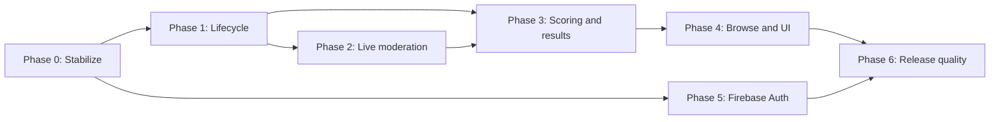

# Bongii implementation plan

This is the execution checklist for the product behavior in [PRODUCT_SPEC.md](PRODUCT_SPEC.md) and the architecture in [TECHNICAL_DESIGN.md](TECHNICAL_DESIGN.md).

## Planning rules

- Priority `P0` blocks a safe release, `P1` is core product behavior, and `P2` is valuable follow-up work.
- A phase is complete only when its acceptance checks pass, including failure and reconnect cases.
- Server data is authoritative. A client-only visual change does not complete a feature.
- Schema changes use migrations and a production backup. Do not add more unconditional `ALTER TABLE` calls to startup.
- Keep each pull request limited to one vertical behavior with tests.

## Delivery order

## Phase 0: Stabilize the foundation

Priority: `P0`

Goal: make current behavior safe to extend and establish a fast regression check.

### API and data cleanup

- [ ] Split `server/index.js` into app creation, route modules, authentication middleware, and a server entry point.
- [ ] Remove duplicate `GET /campaigns/:code` and `POST /campaigns` route declarations.
- [ ] Implement and export the campaign status operation currently called by the start route, or remove that route in favor of the Phase 1 transition API.
- [ ] Remove the unauthenticated `POST /api/clean` route from deployed builds.
- [ ] Verify every referenced database method exists; remove unfinished RPG-style join fields and dead client service calls.
- [ ] Return correct HTTP statuses: `400` validation, `401` unauthenticated, `403` unauthorized, `404` missing, and `409` invalid state transition.
- [ ] Add request validation for campaign, board, item outcome, and profile payloads.
- [ ] Enable SQLite foreign keys and use transactions for multi-row writes.
- [ ] Stop returning password fields from user queries and stop logging user records or credentials.

### Configuration and migrations

- [ ] Replace `/data/test.db` with a required `DATABASE_PATH` setting that has a documented local default.
- [ ] Replace the client's hard-coded API host with `NEXT_PUBLIC_API_BASE_URL`.
- [ ] Add `.env.example` files with non-secret placeholders.
- [ ] Introduce ordered SQLite migration files and a `schema_migrations` table.
- [ ] Document backup, migrate, verify, and rollback procedures for the Fly.io volume.

### Test baseline

- [ ] Extract app creation so API tests can run without opening a network port.
- [ ] Add a temporary SQLite database fixture.
- [ ] Add one API smoke test for campaign creation and one for board creation.
- [ ] Add an authorization regression test proving one user cannot moderate another user's campaign.
- [ ] Add client lint and build commands that pass in CI.
- [ ] Add a GitHub Actions workflow for server tests and the client build.

### Acceptance checks

- [ ] A fresh database migrates from zero to the current schema exactly once.
- [ ] A copied production schema migrates without losing campaigns or boards.
- [ ] No public endpoint can erase all data.
- [ ] Local client and API startup require no source edits and never default to production.
- [ ] The baseline CI workflow passes from a clean checkout.

## Phase 1: Authoritative campaign lifecycle

Priority: `P1`

Goal: represent open entries, waiting for results, active moderation, and completed history as real server states.

### Domain and database

- [ ] Migrate existing `waiting` campaigns to `open`, `active` campaigns to `moderating`, and retain `completed`.
- [ ] Add `draft`, `open`, `locked`, `moderating`, `completed`, and `cancelled` constraints.
- [ ] Add lifecycle timestamps: `publishedAt`, `boardCreationClosedAt`, `moderationStartedAt`, `finalizedAt`, and `cancelledAt`.
- [ ] Add a monotonically increasing campaign `version` for reconnect and stale-update detection.
- [ ] Implement a single transition service containing the allowed state graph.
- [ ] Make board creation transactional and legal only in `open`.
- [ ] Prevent campaign category or board edits once entries are locked.

### API and client

- [ ] Add moderator endpoints to publish, lock, reopen, start moderation, cancel, and later finalize.
- [ ] Include allowed next actions in moderator campaign responses.
- [ ] Add working lifecycle controls to `client/src/app/moderate/[campaignCode]/page.js`.
- [ ] Show status and read-only state on campaign and board pages.
- [ ] Replace date-derived labels such as "This campaign is live" with server state.

### Acceptance checks

- [ ] Two simultaneous board submissions at lock time cannot create a board after the lock commits.
- [ ] Invalid transitions return `409` and leave data unchanged.
- [ ] A non-owner receives `403` for every lifecycle mutation.
- [ ] Existing campaign and board URLs continue to resolve after migration.

## Phase 2: Moderator-controlled real-time outcomes

Priority: `P1`

Goal: one moderator decision updates every relevant board without player marking.

### Outcome model and API

- [ ] Replace ambiguous item statuses with `pending`, `happened`, and `did_not_happen`.
- [ ] Record `decidedAt` and `decidedBy` for each change.
- [ ] Add an owner-only item outcome endpoint that verifies the item belongs to the campaign.
- [ ] Permit reverting to pending only before completion.
- [ ] Return tile outcomes in board snapshots.

### Socket.IO transport

- [ ] Wrap Express in an HTTP server and add Socket.IO to server and client packages.
- [ ] Join viewers to a room scoped by campaign code.
- [ ] Emit versioned status, outcome, and snapshot-invalidated events only after a database commit.
- [ ] Add exact-origin CORS rules for Vercel production, preview, and local development.
- [ ] Refetch the authoritative snapshot after reconnect, version gaps, or malformed events.
- [ ] Add connection-state telemetry without logging tokens or private fields.

### Moderator and board interfaces

- [ ] Build compact three-state item controls grouped by category.
- [ ] Show pending and decided counts plus save, retry, and reconnect states.
- [ ] Remove player tile click handlers and local `marks` state.
- [ ] Derive green, red, and neutral board tiles from server outcomes.
- [ ] Pair color with check, X, and pending icons plus accessible labels.
- [ ] Animate only the tile whose outcome changed and disable that animation for reduced motion.

### Acceptance checks

- [ ] A moderator update appears on two open board clients without refresh.
- [ ] Only boards containing the changed item alter a tile.
- [ ] Refreshing or reconnecting reproduces the same state.
- [ ] An unauthorized socket or REST client cannot mutate outcomes.
- [ ] A stale event cannot overwrite a newer campaign version.

## Phase 3: Finalization, scoring, and leaderboard

Priority: `P1`

Goal: finish a campaign atomically and publish deterministic results.

### Scoring engine

- [ ] Implement scoring as a pure server module with no database calls.
- [ ] Cover 3 by 3, 4 by 4, and 5 by 5 rows, columns, and diagonals.
- [ ] Count the center as a free happened tile and exclude empty cells.
- [ ] Calculate longest contiguous run, completed line count, and matched tile count.
- [ ] Assign shared ranks for equal score tuples.
- [ ] Add a `rulesVersion` constant and fixture-based unit tests.

### Finalization and result storage

- [ ] Add campaign and board result snapshot tables.
- [ ] Implement one `BEGIN IMMEDIATE` transaction that resolves pending items as did not happen, scores all boards, stores ranks, and completes the campaign.
- [ ] Make finalization idempotent.
- [ ] Block all outcome writes after completion.
- [ ] Emit the completed event only after commit.
- [ ] Add a public, paginated campaign results endpoint.

### Leaderboard UI

- [ ] Add `/leaderboards` for campaign discovery and `/leaderboards/[campaignCode]` for results.
- [ ] Show rank, player, longest run, completed lines, total matches, and a board preview.
- [ ] Link each result to its read-only board.
- [ ] Show shared ranks correctly and explain the scoring order.
- [ ] Add a finalization confirmation that states how many pending items will become red.

### Acceptance checks

- [ ] The same finalized data produces byte-for-byte equivalent score values on repeated reads.
- [ ] Concurrent finalization requests create one result snapshot.
- [ ] Pending items are red on every board after finalization.
- [ ] Ties share rank and the next rank follows competition ranking.
- [ ] A completed campaign survives API restart with the same leaderboard.

## Phase 4: Browse model and visual cleanup

Priority: `P1`

Goal: make campaign state obvious and the application comfortable to read while keeping its game identity.

### Browse and navigation

- [ ] Add Open, Awaiting results, and Results tabs backed by server query filters.
- [ ] Add title search, board count, board size, status, relevant date, and one contextual action per campaign.
- [ ] Preserve the selected tab and search in URL query parameters.
- [ ] Add loading skeletons, errors with retry, and useful empty states.
- [ ] Add Leaderboards to the primary navigation.
- [ ] Separate owner campaigns from public browsing in the moderation area.

### Design system and accessibility

- [ ] Define semantic tokens for page, panel, text, border, focus, happened, failed, pending, and campaign accent colors.
- [ ] Replace full-screen animated gradients on work screens with a quiet, high-contrast surface.
- [ ] Disable the particle canvas by default outside the home screen.
- [ ] Add a persistent Reduce motion setting and honor the operating-system preference.
- [ ] Replace glass effects where they reduce text contrast.
- [ ] Standardize buttons, fields, tabs, status badges, dialogs, and toast messages.
- [ ] Make every workflow keyboard usable with visible focus states.
- [ ] Test zoom to 200 percent and viewports from 320 pixels through wide desktop.
- [ ] Add automated accessibility checks and a manual screen-reader pass.

### Acceptance checks

- [ ] Campaign status and next action are understandable without relying on color.
- [ ] Body text and controls meet WCAG 2.2 AA contrast.
- [ ] No board text or control overlaps at supported viewport widths.
- [ ] Reduced-motion mode removes particles, ambient gradients, and nonessential transitions.
- [ ] The UI still has recognizable campaign accents and satisfying outcome feedback.

## Phase 5: Firebase Authentication and profiles

Priority: `P1` for password security, `P2` for uploaded avatars

Goal: remove password ownership from Bongii while retaining SQLite for game and profile data.

### Authentication

- [ ] Create separate Firebase projects for development and production.
- [ ] Enable email/password and Google providers; do not enable phone authentication.
- [ ] Add Firebase client initialization and an application-wide auth provider.
- [ ] Add email registration, sign-in, sign-out, verification, and forgot-password screens.
- [ ] Send Firebase ID tokens to Express and verify them with the Admin SDK.
- [ ] Key local user records by unique `firebaseUid`, not username.
- [ ] Replace scattered local-storage token reads with one authenticated API client.
- [ ] Preserve the return URL across sign-in.
- [ ] Rate-limit sensitive endpoints and configure authorized domains.

### Existing-account migration

- [ ] Audit current users for missing or duplicate email addresses before choosing a migration path.
- [ ] Back up the database and notify affected users.
- [ ] Link migratable accounts without changing campaign ownership.
- [ ] Provide manual recovery for users without a usable email address.
- [ ] Clear legacy password values immediately after successful migration.
- [ ] Remove password login and the password column after a measured migration window.

### Profiles and avatars

- [ ] Sync display name and Google `photoURL` into the local profile record.
- [ ] Keep preset avatars as the no-billing fallback.
- [ ] Validate image host, size, and fallback behavior in Next.js.
- [ ] Defer direct image uploads until a Blaze billing account, budget alert, file validation, and deletion policy are approved.

### Acceptance checks

- [ ] Email and Google users can reach the same local profile after repeated sign-ins.
- [ ] Password reset and email verification work on the production domain.
- [ ] Revoked, expired, malformed, and wrong-project tokens return `401`.
- [ ] Migrated moderators still own their campaigns.
- [ ] No local password value remains after migration completes.

## Phase 6: Release quality and operations

Priority: `P1`

- [ ] Add Playwright journeys for create board, lock, moderate from one browser, observe from two others, finalize, and view results.
- [ ] Run Socket.IO reconnect and duplicate-event tests.
- [ ] Add structured request IDs and redacted server logs.
- [ ] Add health and readiness endpoints that do not expose configuration.
- [ ] Track API error rate, socket connections, reconnects, finalization duration, and migration version.
- [ ] Exercise database restore from a Fly.io volume backup.
- [ ] Add dependency and secret scanning in CI.
- [ ] Document local setup, environment variables, API contracts, deployment, rollback, moderation, and scoring.
- [ ] Run a small closed beta with moderators and players on phones before public launch.

## Suggested follow-up backlog

These are worthwhile after the core loop is reliable.

| Priority | Feature | Why it helps |
| --- | --- | --- |
| `P1` | My boards | Signed-in players can recover board links instead of relying on a saved code |
| `P1` | Campaign duplication and templates | Moderators can rerun recurring games without rebuilding categories |
| `P1` | Outcome audit history | Shows who changed an item and supports trustworthy pre-finalization undo |
| `P1` | Archive instead of destructive delete | Protects historical leaderboards and accidental deletion |
| `P2` | Scheduled lock reminders | Reduces missed entry deadlines without making clock inference authoritative |
| `P2` | Shareable result image | Gives winners a useful social artifact without exposing private data |
| `P2` | CSV result export | Helps classrooms, clubs, and event organizers retain results |
| `P2` | Installable PWA | Makes board codes and live boards easier to revisit on phones |
| `P2` | Campaign theme presets | Keeps campaigns playful within an accessible design system |
| `P2` | Optional moderator team | Supports larger events after ownership and audit rules are mature |
| `P2` | Report and rate limits | Reduces spam in public campaign discovery |
| `P2` | Privacy controls | Supports unlisted campaigns, public/private boards, and display-name consent |

## First implementation slice

Start with one small vertical slice from Phase 0:

1. Make database and API URLs environment-driven.
2. Introduce a temporary test database and app factory.
3. Remove or protect the cleanup endpoint.
4. Add one passing campaign API smoke test.
5. Run the client production build in CI.

That slice provides a reliable base for the lifecycle migration without changing game rules at the same time.