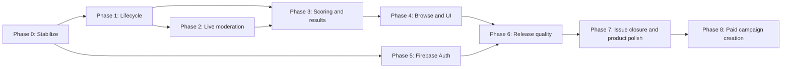

# Bongii 2.0: Bring Back the Bong implementation plan

This is the execution checklist for the product behavior in [PRODUCT_SPEC.md](PRODUCT_SPEC.md) and the architecture in [TECHNICAL_DESIGN.md](TECHNICAL_DESIGN.md).

## Planning rules

- Priority `P0` blocks a safe release, `P1` is core product behavior, and `P2` is valuable follow-up work.
- A phase is complete only when its acceptance checks pass, including failure and reconnect cases.
- Server data is authoritative. A client-only visual change does not complete a feature.
- Schema changes use migrations and a production backup. Do not add more unconditional `ALTER TABLE` calls to startup.
- Keep each pull request limited to one vertical behavior with tests.

## Delivery order

## Phase 0: Stabilize the foundation

Priority: `P0`

Goal: make current behavior safe to extend and establish a fast regression check.

Status: completed and deployed as of 2026-09-10. The ordered migrations have been applied to the upgraded databases without losing account or campaign data.

### API and data cleanup

- [x] Split `server/index.js` into app creation, route modules, authentication middleware, and a server entry point.
- [x] Remove duplicate `GET /campaigns/:code` and `POST /campaigns` route declarations.
- [x] Implement and export the campaign status operation currently called by the start route.
- [x] Remove the unauthenticated `POST /api/clean` route.
- [x] Verify every referenced database method exists; remove unfinished RPG-style routes and dead client service calls.
- [x] Return correct HTTP statuses: `400` validation, `401` unauthenticated, `403` unauthorized, `404` missing, and `409` invalid state transition.
- [x] Add request validation for campaign, board, item outcome, and profile payloads.
- [x] Enable SQLite foreign keys and use transactions for multi-row writes.
- [x] Hash new passwords, upgrade legacy plaintext passwords on successful login, and exclude credentials from responses and logs.

### Configuration and migrations

- [x] Make the database path environment-driven, with a documented local default and the historical production path retained explicitly.
- [x] Replace the client's hard-coded API host with `NEXT_PUBLIC_API_BASE_URL`.
- [x] Add `.env.example` files with non-secret placeholders.
- [x] Introduce ordered, checksummed SQLite migrations and a `schema_migrations` table.
- [x] Document backup, migrate, verify, and rollback procedures for the Fly.io volume.

### Test baseline

- [x] Extract app creation so API tests can run without opening a network port.
- [x] Add a temporary SQLite database fixture.
- [x] Add API smoke coverage for campaign and board creation.
- [x] Add an authorization regression test proving one user cannot moderate another user's campaign.
- [x] Add client lint and build commands that pass locally and in CI.
- [x] Add a GitHub Actions workflow for tests, lint, build, and production dependency audits.

### Acceptance checks

- [x] A fresh database migrates from zero to the current schema exactly once.
- [x] A representative legacy schema migrates without losing its user or campaign data.
- [x] No public endpoint can erase all data.
- [x] Local client and API startup require no source edits and never default to production.
- [x] The commands used by the baseline CI workflow pass locally; its first hosted run occurs after the changes are pushed.

## Phase 1: Authoritative campaign lifecycle

Priority: `P1`

Goal: represent open entries, waiting for results, active moderation, and completed history as real server states.

Status: completed and deployed as of 2026-09-10. Migration `002_campaign_lifecycle.js` has been applied to the upgraded databases.

### Domain and database

- [x] Migrate existing `waiting` campaigns to `open`, `active` campaigns to `moderating`, and retain `completed`.
- [x] Add `draft`, `open`, `locked`, `moderating`, `completed`, and `cancelled` constraints.
- [x] Add lifecycle timestamps: `publishedAt`, `boardCreationClosedAt`, `moderationStartedAt`, `finalizedAt`, and `cancelledAt`.
- [x] Add a monotonically increasing campaign `version` for reconnect and stale-update detection.
- [x] Implement a single transition service containing the allowed state graph.
- [x] Make board creation transactional and legal only in `open`.
- [x] Prevent campaign category or board edits once entries are locked.

### API and client

- [x] Add moderator endpoints to publish, lock, reopen, start moderation, and cancel. Finalization remains in Phase 3 so scoring and completion commit atomically.
- [x] Include allowed next actions in moderator campaign responses.
- [x] Add working lifecycle controls to `client/src/app/moderate/[campaignCode]/page.js`.
- [x] Show status and read-only state on campaign and board pages.
- [x] Replace date-derived labels such as "This campaign is live" with server state.

### Acceptance checks

- [x] Two simultaneous board submissions at lock time cannot create a board after the lock commits.
- [x] Invalid transitions return `409` and leave data unchanged.
- [x] A non-owner receives `403` for every lifecycle mutation.
- [x] Existing campaign and board URLs continue to resolve after migration.

## Phase 2: Moderator-controlled real-time outcomes

Priority: `P1`

Goal: one moderator decision updates every relevant board without player marking.

Status: completed and deployed as of 2026-09-10. Migration `003_item_outcomes.js` has been applied to the upgraded databases.

### Outcome model and API

- [x] Replace ambiguous item statuses with `pending`, `happened`, and `did_not_happen`.
- [x] Record `decidedAt` and `decidedBy` for each change.
- [x] Add an owner-only item outcome endpoint that verifies the item belongs to the campaign.
- [x] Permit reverting to pending only before completion.
- [x] Return tile outcomes in board snapshots.

### Socket.IO transport

- [x] Wrap Express in an HTTP server and add Socket.IO to server and client packages.
- [x] Join viewers to a room scoped by campaign code.
- [x] Emit versioned status, outcome, and snapshot-invalidated events only after a database commit.
- [x] Add exact-origin CORS rules for Vercel production, preview, and local development.
- [x] Refetch the authoritative snapshot after reconnect, version gaps, or malformed events.
- [x] Add connection-state telemetry without logging tokens or private fields.

### Moderator and board interfaces

- [x] Add import JSON when creating a campaign and example JSON download to
  allow for AI generated campaigns (which import and can be modified before posting)
- [x] Build compact three-state item controls grouped by category.
- [x] Show pending and decided counts plus save, retry, and reconnect states.
- [x] Remove player tile click handlers and local `marks` state.
- [x] Derive green, red, and neutral board tiles from server outcomes.
- [x] Pair color with check, X, and pending icons plus accessible labels.
- [x] Animate only the tile whose outcome changed and disable that animation for reduced motion.

### Acceptance checks

- [x] A moderator update appears on two open board clients without refresh.
- [x] Only boards containing the changed item alter a tile.
- [x] Refreshing or reconnecting reproduces the same state.
- [x] An unauthorized socket or REST client cannot mutate outcomes.
- [x] A stale event cannot overwrite a newer campaign version.

## Phase 3: Finalization, scoring, and leaderboard

Priority: `P1`

Goal: finish a campaign atomically and publish deterministic results.

Status: completed and deployed as of 2026-09-10. Migration `004_result_snapshots.js` has been applied to the upgraded databases.

### Scoring engine

- [x] Implement scoring as a pure server module with no database calls.
- [x] Cover 3 by 3, 4 by 4, and 5 by 5 rows, columns, and diagonals.
- [x] Count the center as a free happened tile and exclude empty cells.
- [x] Calculate longest contiguous run, completed line count, and matched tile count.
- [x] Assign shared ranks for equal score tuples.
- [x] Add a `rulesVersion` constant and fixture-based unit tests.

### Finalization and result storage

- [x] Add campaign and board result snapshot tables.
- [x] Implement one `BEGIN IMMEDIATE` transaction that resolves pending items as did not happen, scores all boards, stores ranks, and completes the campaign.
- [x] Make finalization idempotent.
- [x] Block all outcome writes after completion.
- [x] Emit the completed event only after commit.
- [x] Add a public, paginated campaign results endpoint.

### Leaderboard UI

- [x] Add `/leaderboards` for campaign discovery and `/leaderboards/[campaignCode]` for results.
- [x] Show rank, player, longest run, completed lines, total matches, and a board preview.
- [x] Link each result to its read-only board.
- [x] Show shared ranks correctly and explain the scoring order.
- [x] Add a finalization confirmation that states how many pending items will become red.

### Acceptance checks

- [x] The same finalized data produces byte-for-byte equivalent score values on repeated reads.
- [x] Concurrent finalization requests create one result snapshot.
- [x] Pending items are red on every board after finalization.
- [x] Ties share rank and the next rank follows competition ranking.
- [x] A completed campaign survives API restart with the same leaderboard.

## Phase 4: Browse model and visual cleanup

Priority: `P1`

Goal: make campaign state obvious and the application comfortable to read while keeping its game identity.

Status: completed locally on 2026-09-09. Hosted CI and a hands-on VoiceOver/NVDA smoke check remain release checks; local Axe, accessibility-tree, keyboard, viewport, test, lint, build, and audit gates pass.

### Browse and navigation

- [x] Add Open, Awaiting results, and Results tabs backed by server query filters.
- [x] Add title search, board count, board size, status, relevant date, and one contextual action per campaign.
- [x] Preserve the selected tab and search in URL query parameters.
- [x] Add loading skeletons, errors with retry, and useful empty states.
- [x] Add Leaderboards to the primary navigation.
- [x] Separate owner campaigns from public browsing in the moderation area.

### Design system and accessibility

- [x] Define semantic tokens for page, panel, text, border, focus, happened, failed, pending, and campaign accent colors.
- [x] Replace full-screen animated gradients on work screens with a quiet, high-contrast surface.
- [x] Disable the particle canvas by default outside the home screen.
- [x] Add a persistent Reduce motion setting and honor the operating-system preference.
- [x] Replace glass effects where they reduce text contrast.
- [x] Standardize buttons, fields, tabs, status badges, dialogs, and toast messages.
- [x] Make every workflow keyboard usable with visible focus states.
- [x] Test zoom to 200 percent and viewports from 320 pixels through wide desktop.
- [x] Add automated accessibility checks and manually inspect the browser accessibility tree for critical workflows.
- [ ] Run a hands-on VoiceOver/NVDA smoke check on the deployed build as a release check.

### Acceptance checks

- [x] Campaign status and next action are understandable without relying on color.
- [x] Body text and controls meet WCAG 2.2 AA contrast.
- [x] No board text or control overlaps at supported viewport widths.
- [x] Reduced-motion mode removes particles, ambient gradients, and nonessential transitions.
- [x] The UI still has recognizable campaign accents and satisfying outcome feedback.

## Phase 5: Firebase Authentication and profiles

Priority: `P1` for password security, `P2` for uploaded avatars

Goal: remove password ownership from Bongii while retaining SQLite for game and profile data.

Status: completed and deployed as of 2026-09-10. Firebase Authentication is active, the databases have been upgraded, and all existing accounts have been migrated without changing campaign ownership.

### Authentication

- [x] Create separate Firebase projects for development and production.
- [x] Enable email/password and Google providers; do not enable phone authentication.
- [x] Add Firebase client initialization and an application-wide auth provider.
- [x] Add email registration, sign-in, sign-out, verification, and forgot-password screens.
- [x] Send Firebase ID tokens to Express and verify them with the Admin SDK.
- [x] Key local user records by unique `firebaseUid`, not username.
- [x] Replace scattered local-storage token reads with one authenticated API client.
- [x] Preserve the return URL across sign-in.
- [x] Configure authorized domains for the deployed environments.

### Existing-account migration

- [x] Audit current users for missing or duplicate email addresses before choosing a migration path.
- [x] Complete the backup-first account migration rollout.
- [x] Link migratable accounts without changing campaign ownership.
- [x] Recover accounts without a usable email address.
- [x] Clear legacy password values immediately after successful migration.
- [x] Disable legacy password login after all accounts are migrated.

### Profiles and avatars

- [x] Sync display name and Google `photoURL` into the local profile record.
- [x] Keep preset avatars as the no-billing fallback.
- [x] Validate image host, size, and fallback behavior in Next.js.
- [x] Defer direct image uploads until a Blaze billing account, budget alert, file validation, and deletion policy are approved.

### Acceptance checks

- [x] Email and Google users can reach the same local profile after repeated sign-ins.
- [x] Password reset and email verification work on the production domain.
- [x] Revoked, expired, malformed, and wrong-project tokens return `401`.
- [x] Migrated moderators still own their campaigns.
- [x] No local password value remains after migration completes.

## Phase 6: Release quality and operations

Priority: `P1`

Status: partially implemented as of 2026-09-10. The remaining scope and schedule are TBD.

- [x] Delegate sensitive sign-in and registration rate limiting to Firebase and remove legacy authentication endpoints.
- [x] Remove the unused local password column with a guarded migration after account migration.
- [x] Add Playwright journeys for create board, lock, moderate from one browser, observe from two others, finalize, and view results.
- [x] Run Socket.IO reconnect and duplicate-event tests.
- [x] Add structured request IDs and redacted server logs.
- [x] Add health and readiness endpoints that do not expose configuration.
- [x] Track API error rate, socket connections, reconnects, finalization duration, and migration version.
- [ ] Exercise database restore from a Fly.io volume backup.
- [x] Add dependency and secret scanning in CI.
- [x] Document local setup, environment variables, API contracts, deployment, rollback, moderation, and scoring.
- [ ] Run a small closed beta with moderators and players on phones before public launch.

## Phase 7: Issue closure and product polish

Priority: `P0` for board correctness and duplicate-action prevention, `P1` for player experience

Goal: resolve the ten non-payment issues in the GitHub issue tracker snapshot from 2026-09-10 while preserving anonymous play, authoritative server state, accessible motion controls, and existing campaign ownership.

Status: planned. The source snapshot contains 11 open issues and no closed issues. Payment work is separated into Phase 8.

### Product decisions and delivery order

1. Fix 4 by 4 board correctness before changing board ownership or live scoring.
2. Preserve anonymous board creation. Signed-in players get profile defaults and account ownership; anonymous players get an unguessable edit token. Add abuse controls instead of making sign-in mandatory.
3. Permit board edits only while the campaign is `open`. Locking entries makes every board read-only.
4. Treat a Bong as one newly completed line. Show Double Bong when one authoritative update completes two or more new lines; reconnecting must not replay old celebrations.
5. Keep campaign themes authoritative on campaign, board, moderation, and result routes. Personal appearance controls may affect only generic application routes.
6. Use Google profile photos or local preset avatars first. Enable direct uploads through Firebase Storage only after Blaze billing, a budget alert, storage rules, validation, and deletion behavior are configured.

### Board correctness, identity, and editing

- [ ] [#7](https://github.com/fayaz12g/bongii/issues/7) Define the free tile only for odd board sizes. Generate and validate all 16 positions of a 4 by 4 board as playable category tiles.
- [ ] Audit existing 4 by 4 boards before rollout. Preserve historical finalized snapshots and bump `rulesVersion` if new scoring semantics differ from stored results.
- [ ] Add API, scoring-fixture, and browser coverage for creating, opening, moderating, finalizing, and ranking a 4 by 4 board.
- [ ] [#2](https://github.com/fayaz12g/bongii/issues/2) Add nullable board ownership and hashed anonymous edit-token fields with an ordered migration; never return token hashes or store raw tokens.
- [ ] Autofill the editable player-name field from the signed-in profile while retaining manual entry for anonymous players.
- [ ] Add an authenticated-or-edit-token board update endpoint. Validate ownership, campaign membership, tile uniqueness, and the `open` lifecycle state in one transaction.
- [ ] Add per-IP and per-campaign board-creation limits without weakening Firebase authentication limits or blocking normal shared-network events.
- [ ] Show an Edit board action only to the signed-in owner or a browser holding the anonymous edit token. Lost anonymous tokens cannot be recovered.
- [ ] [#9](https://github.com/fayaz12g/bongii/issues/9) Replace placeholder avatars with refreshed local presets and use the Google `photoURL` when available.
- [ ] Display the resolved player avatar in board headers and previews, and in the free tile on odd-sized boards. Provide an accessible local fallback when an image fails.
- [ ] Add Firebase Storage avatar upload, replace, and delete flows. Restrict files by owner path, MIME type, byte size, and supported image dimensions; remove superseded objects and account-owned files on deletion.
- [ ] Document Storage billing, budget alerts, security rules, content handling, and rollback before enabling uploads in production.

### Live Bong feedback

- [ ] [#6](https://github.com/fayaz12g/bongii/issues/6) Reuse the server scoring engine to include the current completed-line count in authoritative board snapshots before finalization.
- [ ] Show the current Bong count without relying on color and update it from versioned snapshots.
- [ ] Compare consecutive campaign versions to announce Bong or Double Bong only for newly completed lines. Never celebrate on initial load, stale events, or reconnect recovery.
- [ ] Add focused line highlighting and a bounded overlay that does not cover controls. Replace movement with a static announcement when reduced motion is active and use a polite live region for assistive technology.
- [ ] Test single-line, multi-line, reverted-outcome, stale-event, reduced-motion, and reconnect cases on 3 by 3, 4 by 4, and 5 by 5 boards.

### Server wake and duplicate-action handling

- [ ] [#8](https://github.com/fayaz12g/bongii/issues/8) Add one application-level readiness coordinator that starts a `/api/ready` request on initial load and shares the in-flight result across API consumers.
- [ ] Show a blocking "Waking Bongii" status only after a short delay, retain the user's pending navigation or action, and continue automatically when readiness succeeds.
- [ ] Disable the initiating control and deduplicate mutations while an action is pending so repeated clicks cannot create duplicate campaigns or boards.
- [ ] Use bounded retry and timeout behavior, then replace the wake status with an actionable retry error rather than an indefinite overlay.
- [ ] Start realtime connections after readiness and keep existing snapshot recovery for later disconnects.
- [ ] Add a Playwright cold-start simulation proving one click reaches Browse and Sign in, one submit produces one mutation, focus is managed, and timeout recovery works.

### Route-scoped appearance and mobile controls

- [ ] [#4](https://github.com/fayaz12g/bongii/issues/4) Replace the mutable global campaign preset with a route-scoped theme resolver. Generic Browse, Boards, Leaderboards, authentication, and profile routes must reset to the application theme.
- [ ] [#5](https://github.com/fayaz12g/bongii/issues/5) Remove personal background switching from campaign-scoped player and moderator screens; those routes always restore the campaign's saved colors on load and navigation.
- [ ] [#11](https://github.com/fayaz12g/bongii/issues/11) Restore recognizable color to generic routes with restrained static gradients or bands while retaining WCAG 2.2 AA contrast.
- [ ] Keep particles and snow-like effects off work screens, cap decorative density on the home screen, and render no particles when reduced motion is active.
- [ ] [#12](https://github.com/fayaz12g/bongii/issues/12) Keep one correctly styled Reduce motion switch inside the openable navigation/settings menu and remove duplicate footer controls.
- [ ] [#3](https://github.com/fayaz12g/bongii/issues/3) Make the mobile footer/navigation available at the viewport bottom without scrolling. Account for safe-area insets and reserve content space so it never covers board tiles, forms, dialogs, or toasts.
- [ ] Add 320-pixel-through-desktop visual, keyboard, and accessibility checks for route transitions, menu state, sticky controls, campaign color restoration, and reduced motion.

### Phase 7 acceptance checks

- [ ] A 4 by 4 campaign completes end to end with no center tile and deterministic results.
- [ ] Signed-in board creation starts with the profile name and avatar; anonymous creation remains possible and both ownership paths can edit only while the campaign is open.
- [ ] Bong counts match server scoring, Double Bong appears only for a multi-line update, and reconnects do not replay celebrations.
- [ ] A simulated 15-second API cold start completes the user's original action after one click and cannot duplicate a mutation.
- [ ] Leaving any campaign-scoped route restores the application theme; campaign routes cannot be stranded on a personal background.
- [ ] Color remains visible but restrained, reduced motion removes decorative movement, and the sole motion switch works from the openable menu.
- [ ] The mobile footer remains reachable without scrolling and never obscures interactive content or the current board.
- [ ] Google, uploaded, preset, and failed-image avatar paths render a usable accessible fallback and unauthorized users cannot replace or delete another user's upload.
- [ ] Every non-payment issue in the 2026-09-10 tracker snapshot has a regression test and can be closed with evidence linked from its issue.

## Phase 8: Paid campaign creation

Priority: `P1`

Goal: make campaign creation a paid entitlement without charging players, weakening server authorization, or disrupting management of existing campaigns.

Status: planned for [#10](https://github.com/fayaz12g/bongii/issues/10). Stripe account configuration, product approval, legal policy, and production price IDs are rollout prerequisites.

### Billing authority and data

- [ ] Use Stripe Checkout and Billing Portal for the `$1.99/month` and `$19.99 lifetime` campaign-creation plans. Stripe webhooks, not client redirects, grant entitlements.
- [ ] Create Stripe products and server-configured prices; never accept a price or entitlement claim from the client.
- [ ] Add ordered billing and processed-webhook migrations keyed to the local user and Firebase UID. Keep provider customer IDs, subscription state, period end, lifetime purchase state, and unique event IDs.
- [ ] Introduce a replaceable billing gateway plus authenticated Checkout, Billing Portal, and entitlement-status endpoints.
- [ ] Verify Stripe signatures against the raw webhook body, process events idempotently, tolerate out-of-order delivery, and revoke only recurring entitlements when a subscription actually ends.
- [ ] Enforce campaign-creation entitlement in the server transaction. Existing campaigns remain viewable and manageable after a recurring plan lapses.

### Checkout and operations

- [ ] Replace the Create flow for unentitled users with a concise plan choice and Checkout handoff; restore the original return URL after purchase or cancellation.
- [ ] Cover active, past-due, cancelled, expired, lifetime, duplicate-event, forged-webhook, and Stripe-outage cases with gateway fakes and webhook fixtures.
- [ ] Complete a Stripe test-mode purchase, renewal, cancellation, portal, and lifetime-purchase smoke test before enabling production price IDs.
- [ ] Document secrets, webhook rotation, refunds, support, tax/privacy considerations, metrics, reconciliation, and a kill switch that disables new checkout without granting free entitlements.

### Phase 8 acceptance checks

- [ ] Users with either paid plan can create campaigns, users without an entitlement cannot bypass the server gate, and webhook replay cannot alter entitlement twice.
- [ ] Players can create and view boards without payment, and moderators retain access to campaigns created before an entitlement lapses.
- [ ] Issue [#10](https://github.com/fayaz12g/bongii/issues/10) has automated regression evidence plus a completed Stripe test-mode release check.

## Suggested follow-up backlog

These are worthwhile after the core loop is reliable.

| Priority | Feature | Why it helps |
| --- | --- | --- |
| `P1` | My boards | Signed-in players can recover board links instead of relying on a saved code |
| `P1` | Campaign duplication and templates | Moderators can rerun recurring games without rebuilding categories |
| `P1` | Outcome audit history | Shows who changed an item and supports trustworthy pre-finalization undo |
| `P1` | Archive instead of destructive delete | Protects historical leaderboards and accidental deletion |
| `P2` | Scheduled lock reminders | Reduces missed entry deadlines without making clock inference authoritative |
| `P2` | Shareable result image | Gives winners a useful social artifact without exposing private data |
| `P2` | CSV result export | Helps classrooms, clubs, and event organizers retain results |
| `P2` | Installable PWA | Makes board codes and live boards easier to revisit on phones |
| `P2` | Campaign theme presets | Keeps campaigns playful within an accessible design system |
| `P2` | Optional moderator team | Supports larger events after ownership and audit rules are mature |
| `P2` | Report and rate limits | Reduces spam in public campaign discovery |
| `P2` | Privacy controls | Supports unlisted campaigns, public/private boards, and display-name consent |

## Current delivery status

As of 2026-09-10:

1. Phases 0 through 5 are implemented.
2. Ordered schema migrations have been applied to all active databases.
3. Firebase Authentication is active and all existing accounts have been migrated while retaining campaign ownership.
4. Phase 6 is partially implemented; its remaining scope and schedule are TBD.
5. Phase 7 is planned for the ten non-payment issues in the current GitHub tracker.
6. Phase 8 is planned for paid campaign creation in issue `#10`.