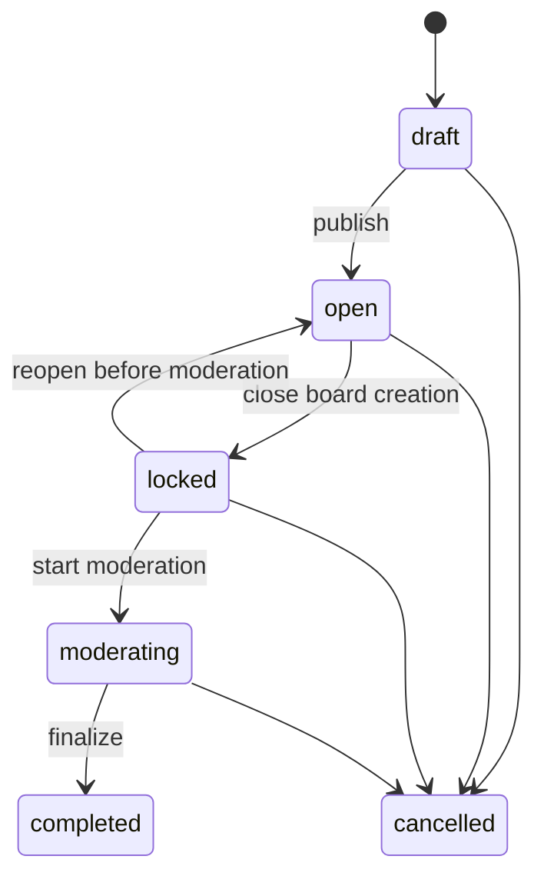

# Bongii product specification

This document defines the intended game behavior. It is the product contract for API, client, and test work.

## Product goal

Bongii is a playful, low-friction prediction bingo game controlled by a campaign moderator. A player decides what might happen before entries close. During or after the event, only the moderator decides what actually happened. Every player's board reflects those decisions in real time, and final results are reproducible from server data.

## Roles

### Moderator

- Must be authenticated.
- Owns the campaign.
- Opens and closes board creation.
- Starts moderation.
- Marks each campaign item as happened, did not happen, or pending.
- Can revise an outcome until finalization.
- Finalizes or cancels the campaign.

### Player

- May create a board anonymously in the first release.
- Selects and arranges tiles only while the campaign is open.
- Uses the board code to return to a board.
- Cannot mark outcomes or alter a submitted board.
- Watches outcomes and campaign state update live.

### Spectator

- Can view a shared board and a public leaderboard.
- Has no write permissions.

## Campaign lifecycle

Campaign state is explicit and server-controlled. Dates may trigger reminders or a future automatic transition, but clients must not infer state from a clock.

| State | Public behavior | Moderator actions |
| --- | --- | --- |
| `draft` | Hidden and no boards allowed | Edit, publish, or delete |
| `open` | Listed under Open; boards can be created | Edit safe fields, lock entries, or cancel |
| `locked` | Listed under Awaiting results; boards are read-only | Reopen entries or start moderation |
| `moderating` | Listed under Awaiting results; outcomes update live | Set outcomes or finalize |
| `completed` | Listed under Results; leaderboard is available | View and export only |
| `cancelled` | Hidden by default; no leaderboard | View or archive only |

Allowed transitions:

Initial implementation can create campaigns directly in `open`; the `draft` screen can follow later. Board creation is accepted only while the campaign is `open`, enforced by the server rather than merely hidden in the client.

## Outcome rules

The canonical outcomes are:

| Outcome | Meaning | Board treatment |
| --- | --- | --- |
| `pending` | Moderator has not decided | Neutral |
| `happened` | The prediction came true | Green with a check icon and text label |
| `did_not_happen` | The prediction did not come true | Red with an X icon and text label |

This specification deliberately uses green for happened and red for did not happen. That is consistent with the rule that unresolved items become red when finalized and avoids the ambiguity of the current `correct` and `incorrect` names. Status must never be communicated by color alone.

The center tile remains a free space and counts as happened for scoring. Empty non-center positions never count.

During moderation:

- Only the campaign owner can change outcomes.
- An outcome can be returned to pending before finalization.
- Every saved change is immediately visible on all boards containing that item.
- A refresh or reconnect produces the same board state as a continuously connected client.
- Player clicks do not change tile outcomes.

During finalization:

- Every pending campaign item becomes `did_not_happen`.
- All board scores are calculated in one database transaction.
- Results and the campaign state become immutable after the transaction commits.
- Clients receive a completed snapshot and a link to the leaderboard.
- Repeating a finalization request returns the existing result without creating duplicates.

## Scoring and ranking

A scoring line is any complete row, column, or one of the two full diagonals. All boards in one campaign use the same dimensions.

For each board, calculate:

1. `longestRun`: the longest contiguous run of happened tiles in any scoring line.
2. `completedLineCount`: the number of scoring lines in which every position happened.
3. `matchedTileCount`: the total number of happened tiles on the board.

Rank boards by those values in that order, descending. Boards with the same three values share a rank. Sort tied rows by player name and board code only for stable display; that sort does not break the tie.

Example for a 3 by 3 campaign:

| Player | Longest run | Completed lines | Matched tiles | Rank |
| --- | ---: | ---: | ---: | ---: |
| Ada | 3 | 2 | 7 | 1 |
| Sam | 3 | 1 | 6 | 2 |
| Lee | 2 | 0 | 7 | 3 |

Scoring rules are versioned with each finalized result so later rule changes cannot alter historical leaderboards.

## Required screens

### Browse

Use three primary tabs:

- Open: campaigns accepting boards, with a Create board action.
- Awaiting results: locked and moderating campaigns, with a View board or Watch action.
- Results: completed campaigns, with a View leaderboard action.

Each campaign row shows title, status, relevant time, number of boards, board size, and one clear action. Search and empty states are required. Cancelled campaigns are excluded unless an archive filter is selected.

### Moderator console

- Shows campaign status and the next valid lifecycle action.
- Groups items by category in a compact, scannable list.
- Gives each item a three-state control: pending, happened, did not happen.
- Shows saved, reconnecting, and error states.
- Shows counts for decided and pending items.
- Requires confirmation before locking entries, finalizing, or cancelling.
- Warns that pending items will become did not happen in the finalization confirmation.

### Player board

- Is read-only after submission.
- Shows live connection state without obscuring the board.
- Uses stable square dimensions at every viewport size.
- Shows icon, label, and color for resolved outcomes.
- Highlights completed lines without covering tile text.
- Links to results when the campaign completes.

### Leaderboard

- Is browsable by campaign and directly linkable.
- Shows shared ranks, player names, score details, and a board preview.
- Lets a visitor open any listed board.
- Clearly states the scoring rule.
- Does not expose email addresses or other private profile fields.

## Visual direction

Bongii should feel like a game without making routine actions difficult to read.

- Use a mostly static, high-contrast page surface for application screens.
- Keep campaign color as an accent on headers, status chips, and board details rather than as a full animated background.
- Turn particles off by default outside the home screen.
- Respect `prefers-reduced-motion` and provide a persistent Reduce motion setting.
- Reserve motion for outcome changes, completed lines, and final results.
- Use a display typeface for campaign titles and a highly legible body face for controls and board text.
- Meet WCAG 2.2 AA contrast and keyboard interaction requirements.
- Pair green and red states with icons and words for color-vision accessibility.
- Keep board controls and content usable at 320 CSS pixels wide.

## Product decisions still required

These decisions do not block Phase 0 but must be resolved before the named phase begins:

| Decision | Recommended default | Needed by |
| --- | --- | --- |
| Should locking occur automatically at a configured time? | Start with manual locking; add optional scheduling later | Phase 1 |
| Are leaderboards public by default? | Public to anyone with the campaign code | Phase 3 |
| Can anonymous players reclaim a lost board? | Add an unguessable edit token before editable boards | Future backlog |
| How are existing local accounts migrated? | One-time migration for valid email users; manual recovery otherwise | Phase 5 |
| Are profile image uploads required at launch? | Use Google photo or preset avatar first | Phase 5 |

## Out of scope for the first complete release

- Player-controlled tile marking.
- Cash prizes, wagering, or paid entry.
- Chat and direct messages.
- Multiple moderators per campaign.
- Editing finalized outcomes or recalculating historical results.
- Phone-number authentication.